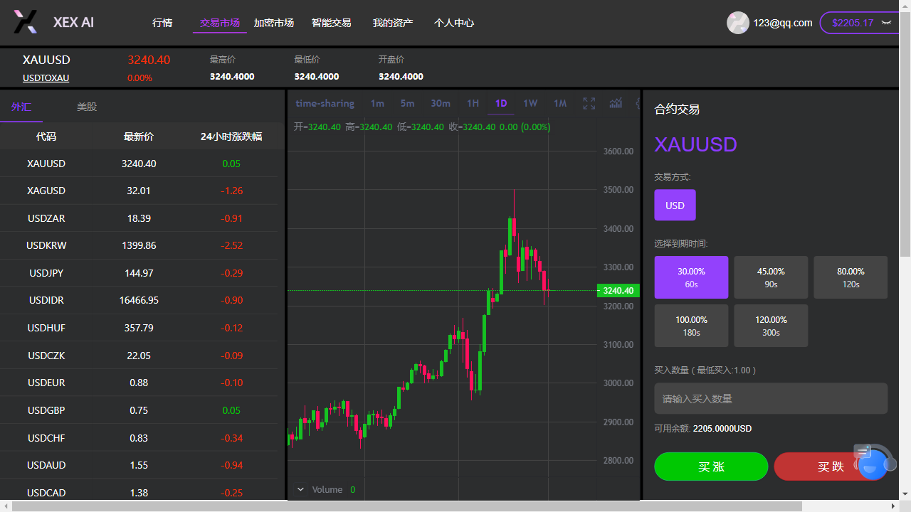
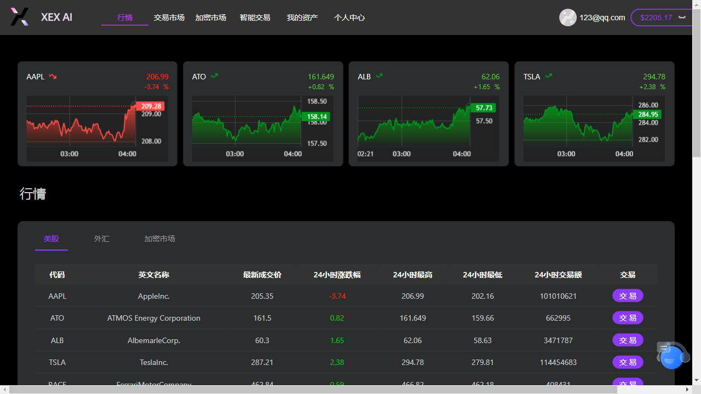
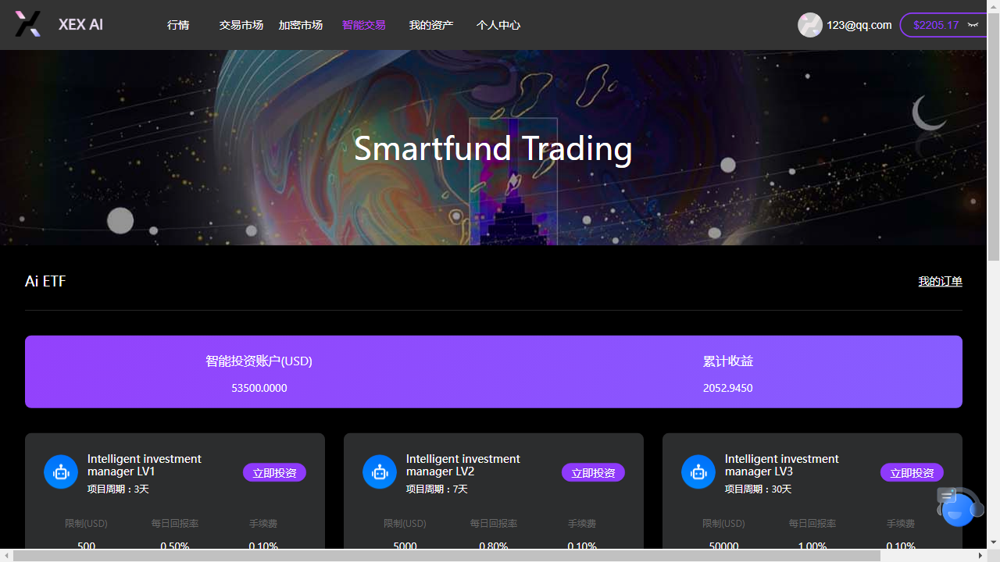

# sevenlab-site
<!DOCTYPE html>
<html lang="zh">
<head>
  <meta charset="UTF-8">
  <meta name="viewport" content="width=device-width, initial-scale=1">
 
  <meta name="description" content="七点科技，专注于数字资产交易平台开发，提供产品导航与行业新闻聚合。">
  <meta name="keywords" content="七点科技, 数字货币交易系统, 区块链, 秒合约, 撮合引擎, 新闻聚合, GNews, GitHub Pages">
  <link rel="stylesheet" href="styles.css">
</head>
<body>
  <header>
    <h1>七点科技</h1>
    <nav>
      <a href="https://jkjj8899.github.io/sevenlab-site/news.html">📰 行业新闻</a>
      <a href="https://github.com/jkjj8899">GitHub</a>
      <a href="https://t.me/sy89899">Telegram</a>
      <a href="https://www.3xex.com">官网</a>
    </nav>
  </header>

  <section class="hero">
    <h2>用技术构建交易未来</h2>
    
我们专注于轻量级数字资产平台、撮合引擎与秒合约解决方案

  </section>

  
<section class="products">
  <h3>我们的产品</h3>

  

    
    

      <h4>⚡ 秒合约交易系统</h4>
      
支持毫秒级撮合、爆仓机制、可快速部署至全球市场。

      <a href="https://jkjj8899.github.io/jkjj8899/">查看演示 →</a>
    

  

  

    
    

      <h4>📊 实时行情系统</h4>
      
多币种实时行情对接火币、币安 WebSocket，支持 K线图与深度图。

      <a href="https://www.3xex.com/quote">了解更多 →</a>
    

  

  

    
    

      <h4>🧠 AI 智能交易系统</h4>
      
自动策略下单，结合机器学习预测与风险控制。

      <a href="https://www.3xex.com/etf">立即体验 →</a>
    

  

</section>
  <section class="contact">
    <h3>合作与定制</h3>
    
欢迎交易所、钱包、做市商合作接入。我们支持 API 对接、KYC 合规系统、一站式部署。

    <a href="mailto:your@email.com">📩 发送合作邮件</a> · 
    <a href="https://t.me/sy89899">联系 Telegram</a>
  </section>

  <footer>
    
© 2025 七点科技 · 技术驱动 · 专业定制 · <a href="https://jkjj8899.github.io/sevenlab-site/news.html">查看每日新闻</a>

  </footer>
</body>
</html>
